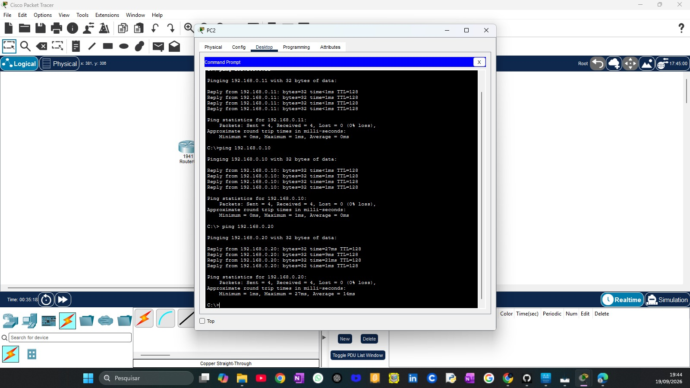
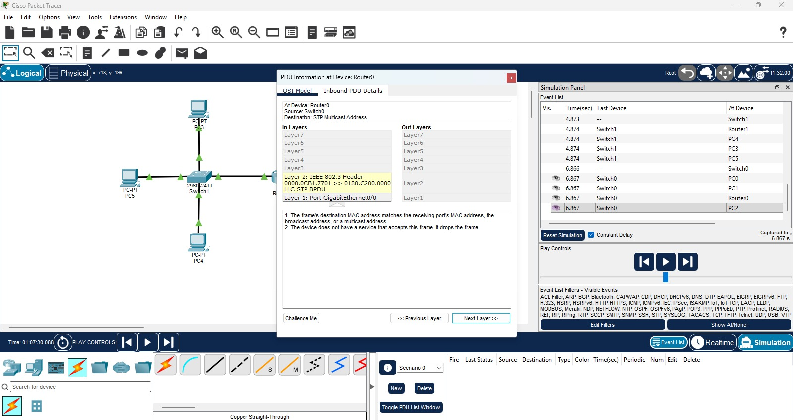
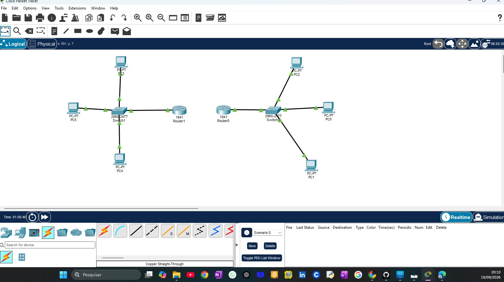

# Cisco-Packet-Tracer-
practical networking lab developed with Cisco Packet Tracer, focusing on LAN connectivity and network fundamentals
##  Objective

The objective of this lab is to practice computer networking fundamentals using Cisco Packet Tracer.

The lab demonstrates communication between PC3 and PC4 through a network switch within a Local Area Network (LAN).

##  Tools Used

- **Cisco Packet Tracer**
  - Version: 8.x (confirm installed version)
  - Purpose: Network simulation and connectivity testing.

- **Network Switch**
  - Device: Cisco switch (model to be confirmed)
  - Purpose: Connecting PCs within the LAN.

- **End Devices**
  - Devices: PC3 and PC4
  - Purpose: Testing communication between network devices.
 
  ##  Devices Details

###  End Devices

- **PC3**
  - Role: Source device.
  - Function: Sends data packets to PC4 through the network switch.

- **PC4**
  - Role: Destination device.
  - Function: Receives data packets sent by PC3.

###  Network Switch

- **Device:** Cisco Network Switch
- **Function:** Connects PC3 and PC4 within the local area network (LAN).
- **Role:** Forwards network traffic between connected devices.

###  Network Connections

- PC3 connected to the network switch.
- PC4 connected to the network switch.
- Communication tested using packet transmission.

  ##  Network Topology

The following image shows the network topology created using Cisco Packet Tracer.

## IP Configuration

